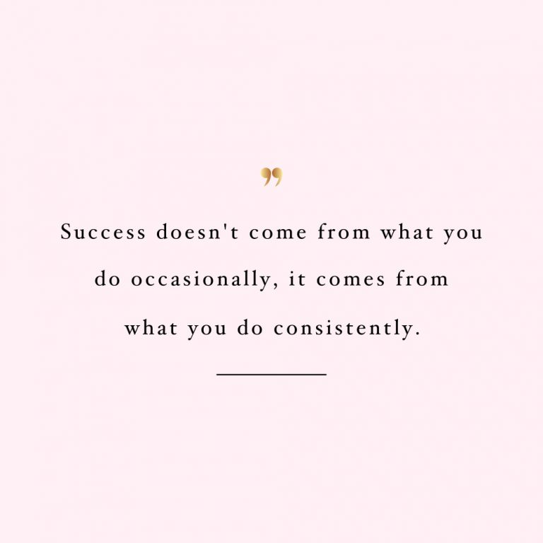

# Learning Repository

This space serves as a documentation of my journey into various technologies such as React, Django, and other exciting technologies that I plan to explore in the future. The primary goal is to consistently push commits as I acquire new knowledge and skills.

This quote by Marie Forleo encapsulates the essence of consistency. In my coding and technology exploration, I firmly believe that success is a result of sustained effort and dedication.

### Technologies
Currently, I am immersed in learning and experimenting with the following technologies:
- HTML, CSS, SCSS
- JavaScript
- Python
- React JS
- Django
- Django Rest Framework (DRF)
- Docker
The list is expected to expand as I delve into more technologies during my learning journey.

### Repository Structure
Each technology I'm learning will have its own dedicated folder.
Commits will be organized by topics or specific projects within each technology.
Feel free to explore the repository and track my progress.